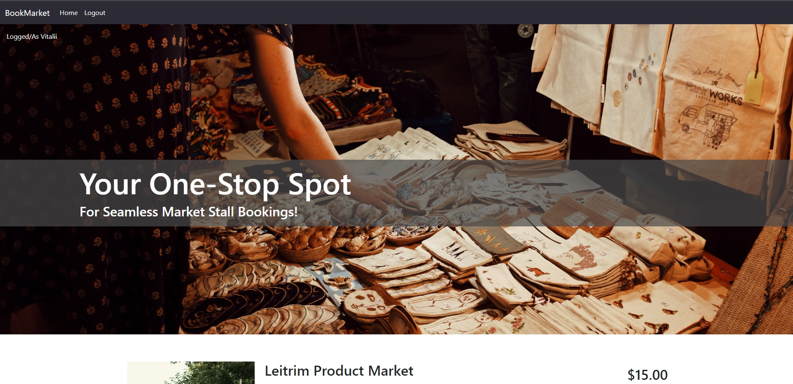
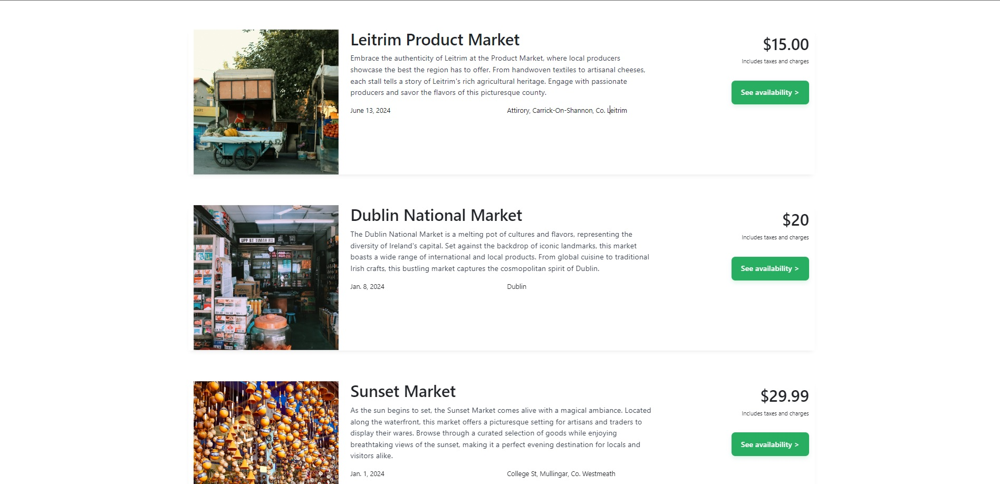
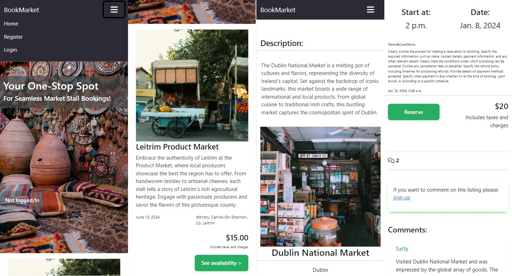
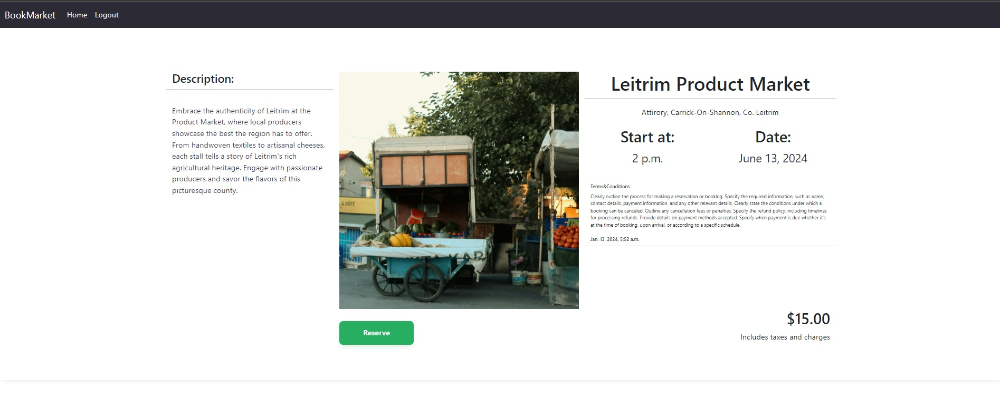
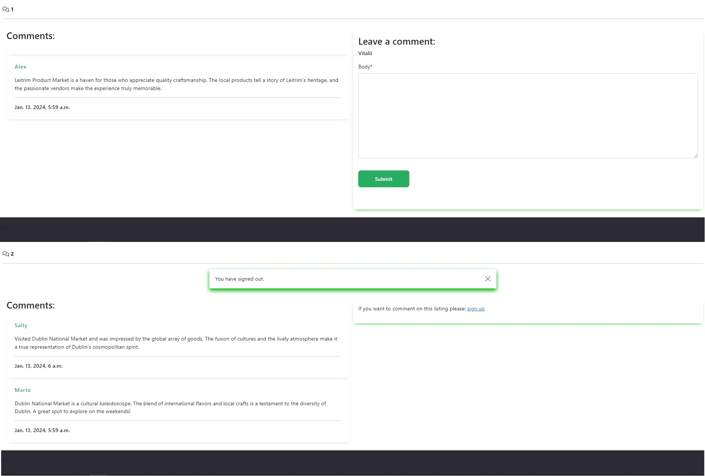
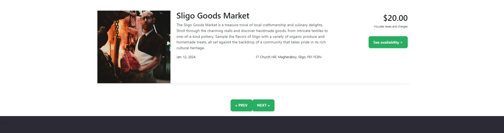

# Book Your Market

The website, "Book Your Market," is a platform designed for seamless market stall bookings.

# Key Features:
# Homepage (home.html):
## Navigation Bar:

-Responsive Bootstrap navbar with a brand logo and menu button.
-Dynamic highlighting of active navigation links.
## User Status Display:

-Indicates whether the user is logged in or not.
## Slogan Section:

-Displays a catchy slogan about being the one-stop spot for market stall bookings.
-Includes visually appealing images of market stalls.
## Main Content Section:

-Placeholder for dynamic content.
-Designed for responsiveness across various screen sizes.
## Dynamic Content:

-Displays detailed information about a market stall listing.
-Images, title, location, date, time, terms and conditions, creation date, and reservation button.
## Comments Section:

-Allows users to leave comments and view existing comments.
-Conditional rendering based on user authentication and comment approval status.
## Alert Messages:

-Displays alert messages for user feedback.
## Authentication Check:

-Prompts users to sign up if they want to comment.
# Listings Page (listings.html):
## Dynamic Listings Display:

-Iterates over a list of market stall listings.
-Responsive layout with Bootstrap grid system.
## Listing Details:

-Displays title, description (linked to detailed view), market date, location, price, and availability button.
## Pagination:

-Provides navigation links to go to the previous or next pages if listings are paginated.
# Technical Features:
## Django Framework:

-Utilizes Django for backend functionality.
-Templates make use of Django template tags for dynamic content.
## Bootstrap Framework:

-Implements Bootstrap for responsive and visually appealing design.
## Crispy Forms:

-Integrates crispy forms for better form rendering.

# Further Development:
## Reservation Functionality:

-Future development will include the addition of reservation functionality.
-Users will be able to reserve market stalls directly through the platform.

## Filtering Options:

-Enhancements will be made to introduce filtering options for users to refine their search.
-Filter options might include location, date, stall type, etc.
